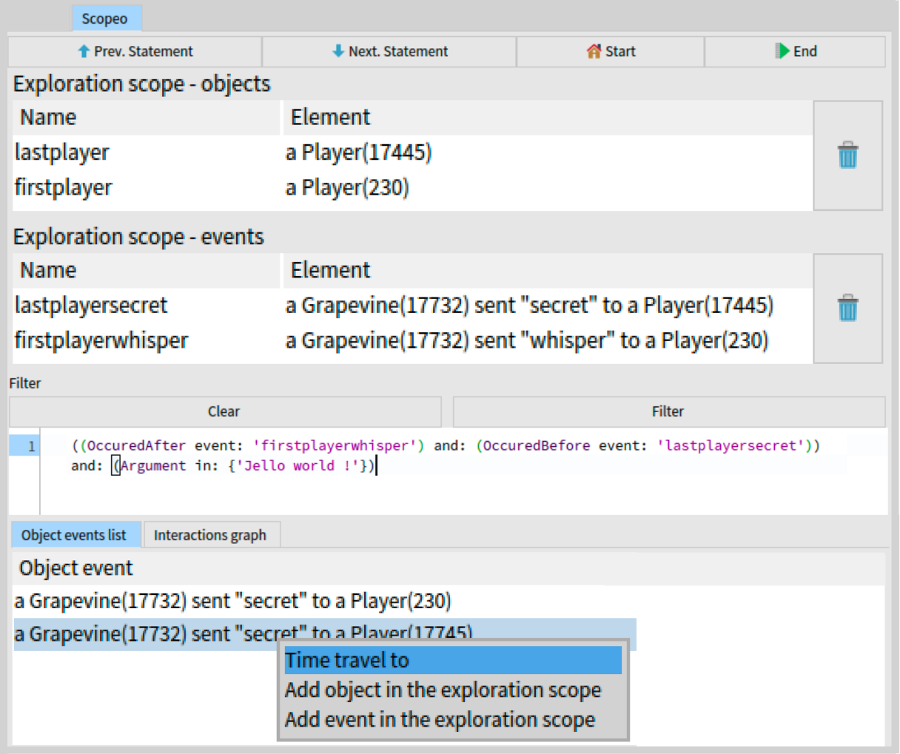
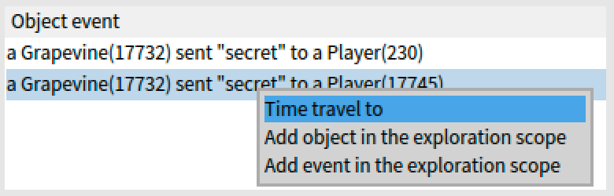
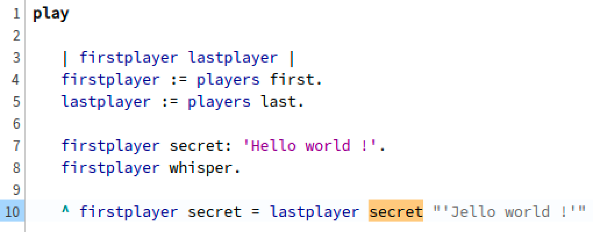
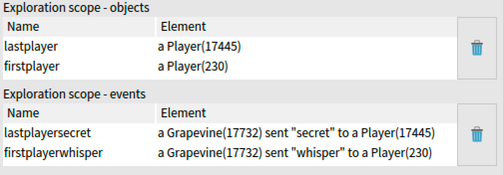
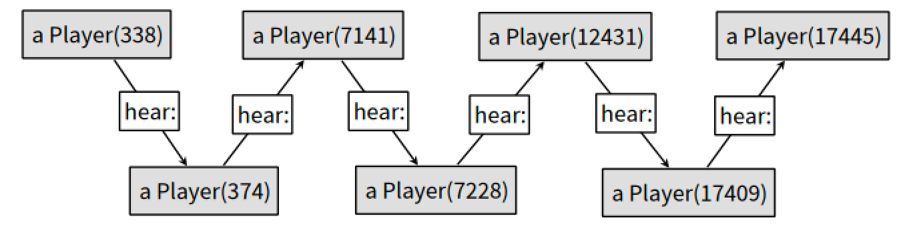
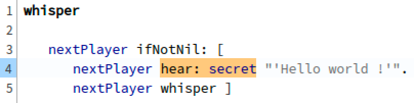

# ScopeoExampleERA

Table of contents:
- [ScopeoExampleERA](#scopeoexampleera)
	- [Introduction](#introduction)
	- [Scopeo's predicates](#scopeos-predicates)
	- [Using Scopeo as a time-travel debugger](#using-scopeo-as-a-time-travel-debugger)
	- [Using Scopeo as a scriptable debugger](#using-scopeo-as-a-scriptable-debugger)
		- [Install Scopeo and try it yourself](#install-scopeo-and-try-it-yourself)

## Introduction

This document presents two examples of how to use Scopeo, an omniscient debugger that records execution data and provide a list of predicates in combination with an exploration scope to explore this data.  

The following screenshot presents Scopeo's UI.  


We detail the list of predicates available in Scopeo.  
In a first debugging example we show how Scopeo works using [Seeker](https://github.com/maxwills/SeekerDebugger) a time-travel debugger as backend for collecting information during the live execution of the program.  
In a second example, we show how to use Scopeo as a back-in-time scriptable debugger, to collect and analyse the execution information after its termination *i.e.* post-mortem.  

## Scopeo's predicates

In both versions the list of predicates is extendable.  
In our future research, we plan to study questions developers ask while debugging to define the minimal list of predicates required to cover these questions.

| **Predicate name**       | **Condition keyword** | **Condition parameter**                            | **Description**                                                                           |
|--------------------------|-----------------------|----------------------------------------------------|-------------------------------------------------------------------------------------------|
| IsMessage                | $\emptyset$           | $\emptyset$                                        | Selects the objects events refering to a message send.                                    |
| IsStateUpdate            | $\emptyset$           | $\emptyset$                                        | Selects the objects events refering to state updates.                                     |
| Type                     | of:                   | a class object                                     | Selects the objects events refering to a given class instances and no other types.        |
| WithType                 | of:                   | a class object                                     | Selects the objects events refering to at least one instance of the a given class.        |
| Result                   | number:               | an array of integers                               | Selects rows in the list of the query results, depending on the given row numbers.        |
| Going                    | to:                   | a string from the exploration scope *e.g.* 'label' | Selects an object's incoming interactions.                                                |
| Coming                   | from:                 | a string from the exploration scope *e.g.* 'label' | Selects an object's outgoing interactions.                                                |
| OccuredBefore            | event:                | a string from the exploration scope *e.g.* 'label' | Selects the objects events occuring before another object event in the execution history. |
| OccuredAfter             | event:                | a string from the exploration scope *e.g.* 'label' | Selects the objects events occuring after another object event in the execution history.  |
| Limit                    | number:               | integer                                            | Selects the first results of the query depending on a given number.                       |
| AssignmentNewValueEq     | value:                | an object                                          | Selects the assignments of the value given in parameter.                                  |
| AssignmentObjectEq       | value:                | an object                                          | Selects the assignments to an instance variable of the object passed in parameter.        |
| AssignmentOldValueEq     | value:                | an object                                          | Selects the assignments to an instance variable containing the value passed in parameter. |
| AssignmentVariableNameEq | value:                | a string                                           | Selects the assignments to an instance variable named as defined in parameter.            |
| MessageArgumentsContains | value:                | an array of values (objects)                       | Selects the messages containing in the arguments the objects passed in parameter.         |
| MessageReceiverEq        | value:                | an object                                          | Selects the messages to the object passed in parameter.                                   |
| MessageSelectorEq        | value:                | a symbol representing the selector                 | Selects the messages using the selector given in parameter.                               |
| MessageSenderClassEq     | value:                | a class object                                     | Selects the messages sent by an object of the class given in parameter.                   |
| MessageSenderEq          | value:                | an object                                          | Selects the messages sent by the object passed in parameter.                              |

## Using Scopeo as a time-travel debugger

The Grapevine game consists in a chain of players where each player has to whisper a secret to the next player.  
The group of players win the game when the secret understood by the last player in the chain is identical to the initial one.  
The difficulty to understand secrets lies in the fact that they are whispered. 

```st
1  Player>>#hear: aSecret
2		| alphabet heardLetter |
3       secret := aSecret.
4		Random new next < 0.2 ifFalse: [ ^ self ].
5		alphabet := Character alphabet asUppercase asOrderedCollection.
6		heardLetter := alphabet remove: aSecret first; atRandom.
7		secret := heardLetter asString, aSecret allButFirst
```

The above code snippets shows how we simulate the difficulty to understand a whispered secret.  
In line 6, we introduced a 20\% probability that the players do not hear the correct secret.   
When a player does not understand the secret, it replaces the first letter of the secret with a random one (lines 5-7).  
The game runs ten rounds and starts with a base of player objects.  
At each round, new players join the game and others leave randomly.  
The secret conveyed on each new round is the string *"Hello world !"*.  
At the end of each round, the last player prints the secret it received and the game compares with the original secret.  
Statistically, at each round the last player prints a wrong secret.  

**In this example, our goal is to understand what happened during the fourth round (this is arbitrary for the sake of our demonstration).**  
To understand the execution of the fourth iteration of the Grapevine game in the scenario we have to gain access to the player objects involved in this iteration.  
For this, we use Scopeo's predicates to ask for all the messages using the accessor `#secret`.  
```st
Selector in: {#secret}
```
The `Selector` predicate filters the messages using the `#secret` accessor.   
It returns twenty results because secrets of the first and last player are compared at each round.  
The first and last player of the fourth round are therefore the seventh and eighth results in the list.   
To only collect these players we add the `Result` predicate with the row numbers **7 and 8** in argument.  
```st
(Selector in: {#secret}) and: (Result number: #(7 8))
```
The following screenshot shows the list of messages using the accessor `#secret` in the fourth round.



The result list contains two elements.
To know which one of these messages refers to the first or last player we press the *Time travel to* button.  
This action brings us to the context of execution of the selected message.
Execution context of the second `#secret` message:



The above screenshot shows the code editor content after time traveling to the second message from the list of results from the second query.  
Line 10, the code highlighted in orange is responsible for the message send. The accessor is called on the last player of the game.  
After asking Pharo to print the value of the expression `last secret` the secret value *Jello world !* is printed as a comment at the end of line 10.   

As the scenario ask to understand the execution of the fourth game round, we wonder where this *Jello world !* secret comes from ?  
To answer this question, we cannot query the entire execution history to search all the `hear:` messages sent with *Jello world !* as an argument because it will return messages from other rounds than the fourth one.  
This is where we add the results of the second query to the exploration scope. 



This screenshot of the exploration scope's UI shows that we stored the *firstplayer* and the *lastplayer* object, by selecting them from the code editor using Scopeo's contextual menu.  
In the exploration scope we also stored the `whisper` (line 8 of the execution context of the second `#secret` message) message sent to the first player of the fourth chain, and the `secret` (line 10 of the execution context of the second `#secret` message) message sent to the last player of the fourth round.  
We can formulate a new query refering to the messages located between the two messages stored in the exploration scope.  

```st
((OccuredAfter event: 'firstplayerwhisper') 
    and: (OccuredBefore event: 'lastplayersecret')) 
    and: (Argument in: {'Jello world !'})
```

The above query is searching for all the object events that occured between the messages labelled by *firstplayerwhisper and lastplayersecret* which transmit the value *Jello world !.*



The screenshot shows the chain of messages who transmitted the value *Jello world !*.  
We observe that the player number 338 is the first to convey the secret *Jello world !* therefore we suppose that this object has transformed the secret it has received.  
To verify this hypothesis we begin a new iteration of the exploration scoping loop, by adding to the exploration scope (S3) the player 338 and the message it to player 374.  
Then we and ask for the first `hear:` message received by player 338 before the message it sent to player 374.  
Traveling to the resulting message allows us to print the value of the secret such as we did before.



This last screenshot shows that player 338 received the secret *Hello world !* which means that the last hypothesis was correct, the player 338 transformed the secret.
Using Scopeo we successfully scoped the exploration around the fourth round of grapevine game and explored the interactions betweens the objects involved in this round to identify the object responsible for the outcome of the game round.

## Using Scopeo as a scriptable debugger

Ammolite is an application that divide student promotions into homogeneous sub-groups.  
Sub-groups are calculated depending on the level of each student, which is represented by a marker '-' or '+'.  

The following test verifies that when printing a student text representation, the last character is the marker, '-' or '+'.

```st
AMParsingBugExample >> testStudentPrinting

	| group students |
	group := AMGroup new.
	students := self promotion students.
	students do: [ :s |
		| str |
		str := WriteStream on: String new.
		group textPrintStudent: s on: str.
		self assert: (#( $- $+ ) includes: str contents last) ]
```

But the test fails. When printing the text representation of a student named Raymond-Tristan, the last character is 'n'.  
How to debug it with Scopeo:

**Step 1:** Run the code using Scopeo.
```st
| scopeo allPrintedStudents failingStudent messagesToFailingStudent markerSetToEmpty |

scopeo := ScpTraces new.
scopeo scan: [ AMParsingBugExample new testStudentPrinting ].
```

**Step 2:** Run a first query to find all messages sent using selector `#textPrintStudent:on:`.
```st
allPrintedStudents := scopeo fetch: (ScpIsMessage new and: (ScpMessageSelectorEq value: #textPrintStudent:on:)).
```

**Step 3:** The last student is the one that has triggered the exception (Raymond-Tristan).
```st
failingStudent := allPrintedStudents last arguments first.
```

**Step 4:** Run a second query to collect all messages sent to the failing student.
```st
messagesToFailingStudent := scopeo fetch: (ScpIsMessage new and: (ScpMessageReceiverEq value: failingStudent)).
```

**Step 5:** Investigation based on the messages received by the failing student.
  1. The failing student has received 6 messages.
  2. The last of these messages is an access to the marker of the failing student made by `AMGroup >> #textPrintStudent:on:`.
  3. The source code of `AMGroup >> #textPrintStudent:on:` shows that the student marker is concatenated at the end of the stream. 
     So the test expects the as last character a marker, '-' or '+'.
  4. The marker of the failing student is an empty string, which is why the test fails.
  5. The marker of the failing student has been set to an empty string by the third message.

```st
messagesToFailingStudent last. "Step 5.2"
failingStudent marker. "Step 5.4"
markerSetToEmpty := messagesToFailingStudent third. "Step 5.5"
```

**Step 6:** Browse the source code of the sender of the message setting the marker to an empty string.
  1. The sender is `AMParsingBugExample >> #promotion`.
  2. At the line 7 we see a loop over the lines of a text stream.
  3. The stream is created from the accessor `AMParsingBugExample >> #students`.
     
```st
(markerSetToEmpty sender class >> markerSetToEmpty senderSelector) browse.
```

**Step 7:** In `AMParsingBugExample >> #students` we search for Raymond-Tristan, our failing student.
  The student has no marker -> the problem therefore comes from the data
  
```st
(AMParsingBugExample >> #students) browse.
```

### Install Scopeo and try it yourself

You can reproduce the scenario entitled "Using Scopeo as a scriptable debugger".
To do so, install the project by executing the following baseline in a Pharo 12 image.

```st
Metacello new
  githubUser: 'ValentinBourcier' 
  	project: 'ScopeoExampleERA' 
  	commitish: 'main' path: 'src';
  baseline: 'ScopeoExampleERA';
  load
```

Then open a playground (via the shortcut "command + O + W" or the menu "Browse"), and follow the steps of the scenario.
At each step you can:
- Copy the given code snippet.
- Inspect the code by doing a right-click > inspect, after selecting the code.

